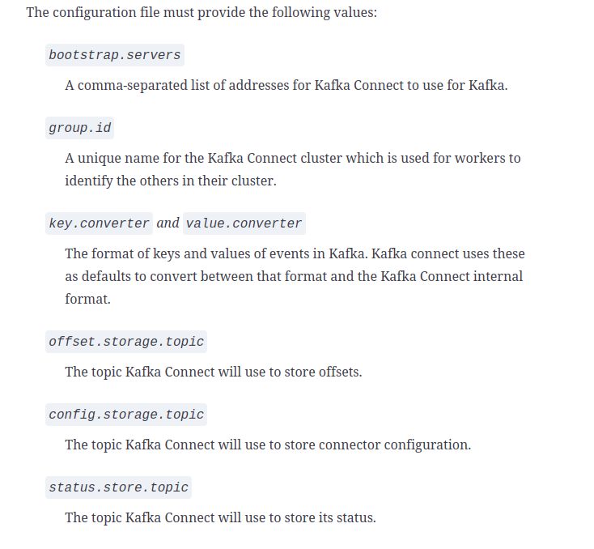

### Stand alone mode
in standalone mode you run a single Kafka Connect process and it stores it state on the filesystem
### Distributed mode
you will have many Connect worker 
#### Note  
<em>before starting up Kafka connect make sure you have a Kafka cluster running.</em>


### Sample Config
````
name=s3sink-field
connector.class=io.confluent.connect.s3.S3SinkConnector
tasks.max=1  
topics=quickstart-events
key.converter=org.apache.kafka.connect.storage.StringConverter
value.converter=org.apache.kafka.connect.storage.StringConverter
s3.bucket.name=hungnv-public
s3.region=ap-northeast-1
#aws.access.key.id=<Acceess key>
#aws.secret.access.key=<Secret Key>
storage.class=io.confluent.connect.s3.storage.S3Storage
format.class=io.confluent.connect.s3.format.json.JsonFormat
#format.class=io.confluent.connect.s3.format.avro.AvroFormat
schema.generator.class=io.confluent.connect.storage.hive.schema.DefaultSchemaGenerator
partitioner.class=io.confluent.connect.storage.partitioner.DefaultPartitioner
schema.compatibility=NONE
key.converter.schemas.enable=false
value.converter.schemas.enable=false
flush.size=1
````
